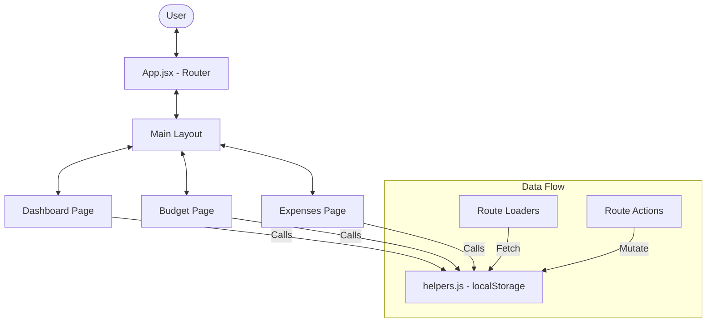

# System Architecture

This document describes the high-level architecture of the HomeBudget WebApp.

## 🏛️ Architecture Overview

The application follows a modern **Single Page Application (SPA)** architecture using **React** and **Vite**. It leverages **React Router v6** for both routing and data management, eliminating the need for complex state management libraries like Redux for this scale.

### Architecture Diagram

## 🚦 Data Management Flow

The application uses an **Action-Loader pattern** provided by React Router.

1.  **Loader**: Before a page component renders, a `loader` function in `src/pages` or `src/layouts` is executed. This function uses `fetchData` from `src/helpers.js` to retrieve the necessary data from `localStorage`.
2.  **Action**: When a user submits a form (e.g., adding a budget), a React Router `action` is triggered. This action calls mutation functions in `src/helpers.js` (like `createBudget`) and then returns a response that triggers a re-validation of the loaders.

## 💾 Storage Strategy

- **Mechanism**: Browser `localStorage`.
- **Key Structure**: The app uses name-spaced keys to support simple multi-user simulation:
    - `userName`: The current logged-in user.
    - `users`: A list of all created users.
    - `budgets_${userName}`: Budgets specific to a user.
    - `expenses_${userName}`: Expenses specific to a user.

## 🛠️ Key Modules

- **`src/helpers.js`**: The central "database" layer. It abstracts all interactions with `localStorage`.
- **`src/actions/`**: Contains side-effect logic for major deletions (Budget, Account, Logout).
- **`src/components/`**: Atomic UI components like `BudgetCard`, `ExpenseItem`, and `AddBudgetForm`.
